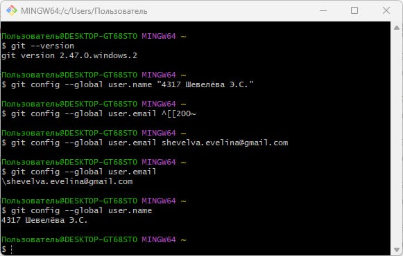
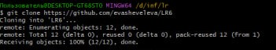
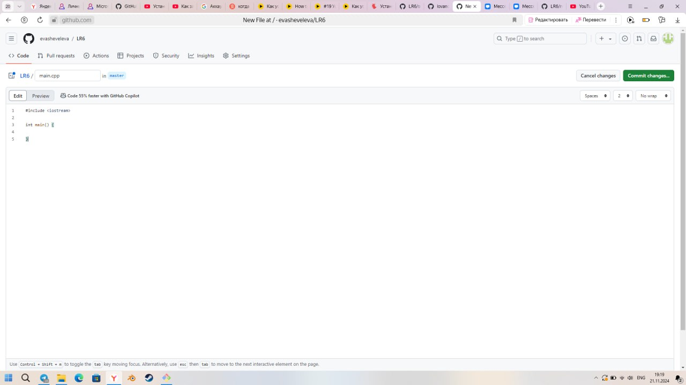
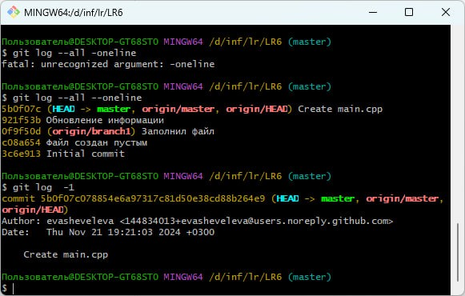
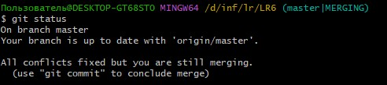
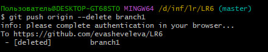
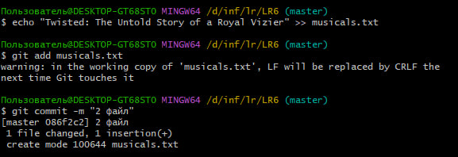
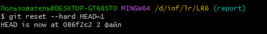
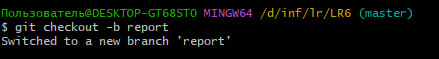

# LR6
Лабораторная работа №6

**Студент:** Шевелёва Эвелина Сергеевна

**Группа:** 4317

# Отчет по работе с Git

## 1. Создание форка
Сделана копия в личное хранилище из https://github.com/Kurtyanik/LR6/

## 2. Установка Git
Установила Гит
## 2. Установка Git
Был установлен Git

## 3. Изменение имени пользователя
Команда для изменения имени пользователя:

```bash
$ git config --global user.name "Группа 4317 Шевелёва Э.С."
```
Команда для изменения почты пользователя:

```bash
$ git config --global user.email "shevelva.evelina@gmail.com"
```
*Результаты изменения имени и почты пользователя*



## 4. Клонирование репозитория

```bash
$ git clone https://github.com/evasheveleva/LR6

```
*Скриншот с клонированием репозитория*



## 5. Добавление нового файла

*Скриншот с добавлением нового файла*



## 6. Добавление изменений в локальный репозиторий

```bash
$ git pull
```


## 7. Получение данных для каждой из веток

```bash
$ git log --oneline --graph --all
```

*Результат работы команды*



## 8. Просмотр последних изменений

```bash
$ git log -1
```


## 9. Решение конфликта и слияние веток

```bash
$ git checkout master
$ git marge origin/branch1
```
Решение конфликта с помощью редактора nano путем замены содержимого mergefile.txt в ветке branch1



## 10. Удаление побочной ветки после слияния

```bash
$ git push origin --delete branch1
```
*Результат работы команды*




## 11. Создание изменений и их фиксирование.

Создание нескольких изменений и коммиты для них

Для наглядной работы с репозиторием необходимо сделать изменения и зафиксировать их, оставляя комментарии. Поочередно в репозиторий были добавлены три текстовых файла: friends.txt, musicals.txt, town.txt



## 12. Откат коммита

Откат к предыдущему коммиту:

```bash
$ git reset --hard HEAD~1
```
*Результат работы команды*



## 13. Создание ветки для отчета
```bash
$ git checkout -b report
```
*Результат работы команды*



## 14. Получение истории операций в форматированном виде

```bash
$ git log --pretty=format:"%h %ad %an %s" --date=short
```

## 15. История операций
Список истории операций:

80ba56d 2024-11-22 4317 Шевелёва Э.С. Добавление рисунков
36ddd8c 2024-11-22 evasheveleva Создание отчёта
d896340 2024-11-21 4317 Шевелёва Э.С. 3 файл
086f2c2 2024-11-21 4317 Шевелёва Э.С. 2 файл
4d649be 2024-11-21 4317 Шевелёва Э.С. 1 файл
be83e57 2024-11-21 4317 Шевелёва Э.С. Merge remote-tracking branch 'origin/branch1'
5b0f07c 2024-11-21 evasheveleva Create main.cpp
921f53b 2020-11-21 Kurtyanik Обновление информации
0f9f50d 2020-11-21 Kurtyanik Заполнил файл
c08a654 2020-11-21 Kurtyanik Файл создан пустым
3c6e913 2020-11-21 Kurtyanik Initial commit

